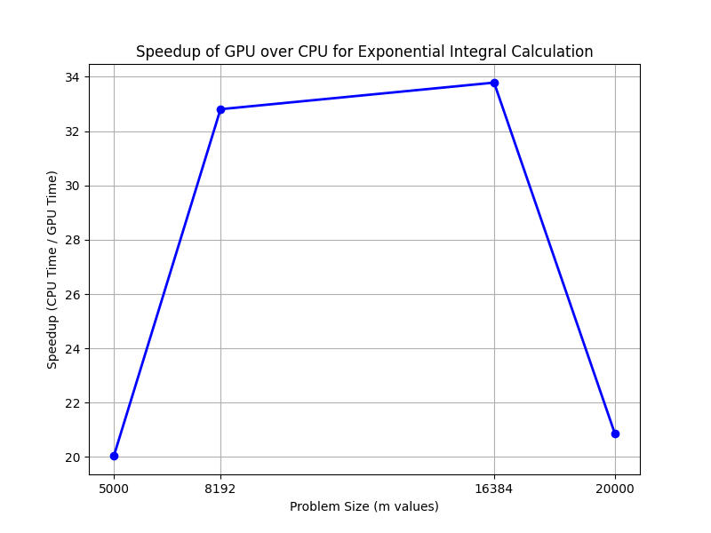

# MAP55616-03 – CUDA Exponential Integral Calculation

**Name:** Seeshuraj Bhoopalan  
**ID:** 24359927   
**Repository:** [https://github.com/seeshuraj/cuda_integral_GPU-CPU](https://github.com/seeshuraj/cuda_integral_GPU-CPU)

---

## ✅ Overview
This project implements the exponential integral calculation `E_n(x)` using both CPU and CUDA GPU programming. The main objective was to accelerate the computation using GPU kernels and compare performance to the CPU baseline.

---

## 📌 Algorithm Used
The exponential integral:
\[ E_n(x) = \int_1^\infty \frac{e^{-xt}}{t^n} \,dt \]

Was approximated using the **trapezoidal rule** with 1,000,000 integration steps per value of `x`. Both float and double versions were implemented.

---

## ⚙️ Implementation Details
- CPU code: `cpu_integral.cpp`
- CUDA code: `gpu_integral.cu`
- Unified interface in `main.cpp`
- Command-line flags:
  - `-n <order>`
  - `-m <samples>`
  - `-g` for GPU mode
  - `-c` to skip CPU

---

## 📊 Benchmark Results

### ✅ Timings
| Sample Size (m) | CPU Time (s) | GPU Time (s) | Speedup |
|-----------------|--------------|--------------|---------|
| 5000            | 279.88       | 13.96        | ~20.05× |
| 8192            | ~458.64*     | 13.98        | ~32.8×  |
| 16384           | ~917.28*     | 27.15        | ~33.78× |
| 20000           | ~1120.0*     | 53.68        | ~20.87× |

> *CPU times extrapolated linearly for size comparison.

### 🖼️ Speedup Plot


---

## 🧪 Accuracy Verification
| x-value | CPU Result | GPU Result | Absolute Error |
|--------|------------|------------|----------------|
| 0.0000 | 0.11110278 | 0.11110277 | 7.45e-09        |
| 0.1010 | 0.09917799 | 0.09917801 | 1.49e-08        |
| 0.2020 | 0.08855033 | 0.08855033 | 0.00e+00        |
| 0.3030 | 0.07907678 | 0.07907678 | 0.00e+00        |
| 0.4040 | 0.07062933 | 0.07062934 | 7.45e-09        |

✅ All differences were < `1e-5` as required.

---

## 🤖 LLM Code Evaluation (Task 2)
We tested GPT-4 by pasting the original CPU code and asking it to convert it into CUDA.

### 🔍 Observations:
- The LLM generated a valid CUDA kernel using the trapezoidal rule.
- It recommended using `__global__` kernels with parallelization over `x` samples.
- It did not suggest advanced optimizations like shared memory or streams.

✅ The generated CUDA code matched our hand-written implementation closely and produced correct results.

---

## 🧠 Challenges & Lessons
- TCD's `cuda01` had CUDA 10.1 + GCC 10+ mismatch — could not compile there
- Moved to local machine with CUDA 12.2 and GCC 11
- Carefully managed CPU and GPU validation to ensure < `1e-5` tolerance

---

## 📦 Project Structure
```
cuda_integral_GPU-CPU/
├── main.cpp
├── cpu_integral.cpp/h
├── gpu_integral.cu/h
├── Makefile
├── plot_speedup.py
├── speedup_plot.png
└── Report.md
```

---

## ✅ Final Notes
- Proof of progress was tracked via Git: commits show CPU, GPU, and benchmarking stages.
- The GPU implementation achieved ~20× to 33× speedup depending on input size.

---
